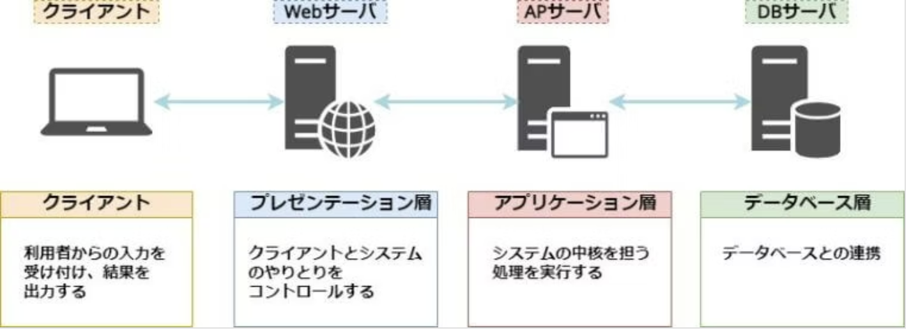

# Webサイトの仕組み

## 目次

1. [Webページが表示されるまで](#1-webページが表示されるまで)
2. [フロントエンドとバックエンドの違い](#2-フロントエンドとバックエンドの違い)
3. [HTTPとHTTPS](#3-httpとhttps)
4. [HTTPメソッド](#4-httpメソッド)
5. [HTTPステータスコード](#5-httpステータスコード)
6. [Cookieとセッション](#6-cookieとセッション)
7. [静的(Static)と動的(Dynamic)Webサイト](#7-静的staticと動的dynamicwebサイト)
8. [URLの構造](#8-urlの構造)
9. [プロトコル一覧](#9-プロトコル一覧)
10. [ドメインとは](#10-ドメインとは)
11. [ネットワーク基礎](#11-ネットワーク基礎)
12. [ブラウザの開発者ツール](#12-ブラウザの開発者ツール)
13. [curlコマンド](#13-curlコマンド)

---

## 1. Webページが表示されるまで

```
ブラウザ → (Request)  → サーバー
ブラウザ ← (Response) ← サーバー
```

| # | 処理 | 担当 |
|---|---|---|
| 1 | ユーザーがURLを入力する | ユーザー |
| 2 | DNSでサーバーのIPアドレスを調べる | ブラウザ |
| 3 | ブラウザがHTTPリクエストを送る（Request） | ブラウザ |
| 4 | サーバーがHTMLなどを返す（Response） | サーバー |
| 5 | ブラウザがHTMLを解析する | ブラウザ |
| 6 | CSS・画像など追加データを取得する | ブラウザ |
| 7 | ブラウザがレンダリングして画面に表示する | ブラウザ |

### ブラウザとは

例：Chrome / Edge / Safari / Firefox

役割：上の表のステップ **2, 3, 5, 6, 7**（URLの解釈からレンダリングまで、ユーザーの手元で行う処理すべて）

### サーバとは

役割：上の表のステップ **4**（リクエストを受けてHTMLなどのレスポンスを返す）

サーバの種類：

| 種類 | 役割 | 例 |
|---|---|---|
| Webサーバー | HTMLや画像などの静的コンテンツを返す | Nginx, Apache |
| APサーバー | アプリケーションの処理をする | Flask, Django, Node.js |
| DBサーバー | データを保存する | SQLite, MySQL, PostgreSQL |



#### Webサーバ

役割：
- HTTPリクエストを受け取る
- 静的コンテンツを返す（HTML / CSS / JavaScript / 画像）
- 必要に応じてリクエストをアプリケーションサーバへ転送する

例：Apache HTTP Server / Nginx / Microsoft IIS

典型的な利用例（静的サイト・シンプルなホスティング）：

```
ブラウザ → Webサーバ → ブラウザ
```

#### Applicationサーバ（APサーバ）

役割：
- バックエンドコードを実行する（PHP / Python / Java / Node.js）
- データベースと接続する
- 動的コンテンツを生成する

例：Tomcat（Java）/ Gunicorn・uWSGI（Python）/ PHP-FPM / Node.js（Express, NestJS）

典型的な利用例：

```
ブラウザ  ─Request─→  Webサーバ  ─Request─→  APサーバ  ─Query─→  DBサーバ
ブラウザ  ←Response─  Webサーバ  ←Response─  APサーバ  ←Result─  DBサーバ
```

#### MVTモデル

APサーバの中でアプリケーションコードをどう役割分担するか、という設計パターンの1つです。Djangoが採用していることで知られ、それぞれの頭文字を取ってMVTと呼びます。

| 要素 | 役割 | 例 |
|---|---|---|
| Model | データベースとのやり取り、データの構造を定義する | SQLAlchemyやDjango ORMの`Model`クラス |
| View | リクエストを受け取り、Modelを使って処理し、Templateに渡す（＝実質的なコントローラー） | Flaskの`views.py`、Djangoの`views.py` |
| Template | 受け取ったデータを画面（HTML）として組み立てる | Jinja2テンプレート、Djangoテンプレート |

```
ブラウザ → View（リクエスト処理） → Model（DB操作） → View → Template（HTML生成） → ブラウザ
```

MVTは、より広く知られている**MVC**（Model・View・Controller）とほぼ同じ考え方です。呼び方の違いは、「画面表示を担当する層」をViewと呼ぶかTemplateと呼ぶか、「リクエスト制御を担当する層」をControllerと呼ぶかViewと呼ぶかの違いです。

| | MVC | MVT |
|---|---|---|
| データ | Model | Model |
| 画面表示 | View | Template |
| リクエスト制御 | Controller | View |

Flask自体はMVTを強制するフレームワークではありませんが、`models.py`（Model）・`views.py`（View）・`templates/`（Template）という構成で作ることが多く、実質的にMVTと同じ役割分担になっています。

---

## 2. フロントエンドとバックエンドの違い

| 区分 | 実行場所 | 主な技術 | 役割 |
|---|---|---|---|
| フロントエンド | ブラウザ | HTML, CSS, JavaScript | 画面の表示・操作 |
| バックエンド | サーバ上 | PHP, Python, Java, Node.js | ロジック（プログラム）・認証・データベース処理 |

---

## 3. HTTPとHTTPS

| | 説明 |
|---|---|
| HTTP | Web上の通信ルール。リクエストとレスポンスの機能を持つ |
| HTTPS（S: Secure） | HTTPの通信を暗号化した通信ルール。データを覗き見られることを防ぐ |

### リクエスト/レスポンスの中身

HTTPのやり取りは、実際には**ヘッダー**（付加情報）と**ボディ**（本体データ）で構成されたテキストです。

リクエストの例：

```
GET /index.html HTTP/1.1
Host: example.com
User-Agent: Mozilla/5.0
```

レスポンスの例：

```
HTTP/1.1 200 OK
Content-Type: text/html
Content-Length: 1234

<html>...</html>
```

| 部分 | 役割 | 例 |
|---|---|---|
| 1行目 | メソッド・パス・バージョン（リクエスト）／ステータス（レスポンス） | `GET /index.html HTTP/1.1` / `HTTP/1.1 200 OK` |
| ヘッダー | 付加情報（`キー: 値`の形） | `Content-Type: text/html`（データの種類を示す） |
| 空行 | ヘッダーとボディの区切り | — |
| ボディ | 実際の中身（HTMLやJSONなど） | `<html>...</html>` |

「12. ブラウザの開発者ツール」のNetworkタブや、「13. curlコマンド」を使うと、この中身を実際に見ることができます。

---

## 4. HTTPメソッド

リクエストの1行目にある「メソッド」は、サーバに対して**何をしたいか**を示します。

| メソッド | 意味 | 例 |
|---|---|---|
| GET | データを取得する | ページの表示、一覧の取得 |
| POST | データを送信する・新規作成する | フォームの送信、新規登録 |
| PUT | データを更新する（全体を置き換え） | レコードの上書き |
| PATCH | データを更新する（一部だけ） | 一部の項目だけ変更 |
| DELETE | データを削除する | レコードの削除 |

### GETとPOSTの違い（最重要）

| | GET | POST |
|---|---|---|
| 主な用途 | データの取得 | データの送信・作成 |
| データの送り方 | URLの末尾（`?key=value`） | リクエストのボディ（見えない） |
| ブラウザの履歴 | 残る（URLに含まれるため） | 残らない |
| 主な使いどころ | 検索、ページ表示 | ログイン、フォーム送信 |

---

## 5. HTTPステータスコード

サーバからのレスポンスには、リクエストの結果を表す3桁の**ステータスコード**が必ず含まれます。

| 分類 | 意味 |
|---|---|
| 1xx | 情報。リクエストを受け取り処理中 |
| 2xx | 成功 |
| 3xx | リダイレクト。追加のアクションが必要 |
| 4xx | クライアントエラー。リクエスト側に問題がある |
| 5xx | サーバーエラー。サーバー側に問題がある |

よく見るステータスコード：

| コード | 意味 |
|---|---|
| 200 OK | 成功 |
| 201 Created | 新規作成に成功 |
| 204 No Content | 成功したが返す内容が無い |
| 301 / 302 | リダイレクト（ページの移動） |
| 400 Bad Request | リクエストの形式が不正 |
| 401 Unauthorized | 認証が必要 |
| 403 Forbidden | アクセス権限が無い |
| 404 Not Found | リソースが見つからない |
| 500 Internal Server Error | サーバー内部でエラーが発生 |
| 503 Service Unavailable | サーバーが一時的に利用不可 |

---

## 6. Cookieとセッション

HTTPは**ステートレス**（1回ごとのやり取りに状態を持たない）な仕組みです。そのため、「誰がログイン中か」のような情報を覚えておくには、別の仕組みが必要になります。それが**Cookie**と**セッション**です。

```
① ログイン成功
   サーバー → ブラウザ:  Set-Cookie: session_id=abc123

② 以降のリクエストすべてに、ブラウザが自動でCookieを付けて送る
   ブラウザ → サーバー:  Cookie: session_id=abc123

③ サーバーは session_id から「誰のリクエストか」を特定できる
```

| 用語 | 説明 |
|---|---|
| Cookie | ブラウザに保存される小さなデータ。サーバーが`Set-Cookie`ヘッダーで送り、以降ブラウザが自動的に付けて送り返す |
| セッション | サーバー側で管理する「ログイン状態」などの情報。Cookieに入れたID（セッションID）と紐づけて管理する |

---

## 7. 静的(Static)と動的(Dynamic)Webサイト

| 種類 | 特徴 | 例 |
|---|---|---|
| 静的サイト（Static） | 常に同じ内容を返す。シンプルなHTMLファイルで構成される | 会社案内、ポートフォリオサイトなど |
| 動的サイト（Dynamic） | 条件に応じてコンテンツが変化する | ログインシステム、フォーラム、ECサイトなど |

---

## 8. URLの構造

```
<スキーム(プロトコル)>://<ドメイン(ホスト名)>:<ポート番号>/<パス>?<クエリ>
```

例：

```
https://example.com:443/path?key=value
```

| 項目 | 意味 |
|---|---|
| スキーム（プロトコル） | 通信方法（どのルールでサーバとやり取りするか） |
| ドメイン（ホスト名） | 接続先サーバの名前（DNSでIPアドレスに変換される） |
| ポート番号 | サーバ内のどのサービスに接続するかを示す番号 |
| パス | サーバ内のどのリソース（ページやAPI）にアクセスするかを示す場所 |
| クエリ | サーバに渡す追加の条件やパラメータ（検索条件など） |

---

## 9. プロトコル一覧

「URLの構造」における**スキーム（プロトコル）**は、通信のルール（どうやってやり取りするか）を表します。よく使うものは以下の通りです。

| カテゴリ | プロトコル | スキーム | 用途 |
|---|---|---|---|
| Web（最重要） | HTTP | `http://` | Webアクセス用。暗号化なし（ほぼ使わない） |
| Web（最重要） | HTTPS | `https://` | Webアクセス用。暗号化あり（標準） |
| サーバ接続 | SSH | `ssh://` | サーバへのログイン（例: `ssh user@192.168.0.10`） |
| ファイル転送 | FTP | `ftp://` | ファイル転送（古い方式・非推奨） |
| ファイル転送 | SFTP | `sftp://` | ファイル転送（SSHベースで安全） |
| DNS | DNS | （URLには出ない） | ドメイン→IPアドレスの変換（例: `8.8.8.8`のような形で問い合わせる） |
| リアルタイム通信 | WebSocket | `ws://` / `wss://` | 双方向通信（チャット・通知など） |
| メール | SMTP | — | メールの送信 |
| メール | IMAP | — | メールの受信（サーバ側でメールを管理） |
| メール | POP3 | — | メールの受信（自分の端末にダウンロード） |

---

## 10. ドメインとは

インターネット上の「名前（住所）」。人間が覚えやすいように付けられた、サーバの名前です。

例：`google.com` / `example.com` / `yahoo.co.jp`

### なぜ必要か

コンピュータ同士は本来IPアドレス（例: `142.250.xxx.xxx`）で通信していますが、人間には覚えにくいため、覚えやすい「ドメイン名」（例: `google.com`）に変換して使います。この変換の仕組みが**DNS（名前解決）**です。

### 名前解決の流れ

```
① URL入力（google.com）
        ↓
② DNSに問い合わせ
        ↓
③ IPアドレス取得（142.250.xxx.xxx）
        ↓
④ サーバにアクセス
        ↓
⑤ Webページ表示
```

### ドメインの構造

```
www  .  example  .  com
 │        │          │
サブ    ドメイン   トップレベル
ドメイン   名      ドメイン(TLD)
```

| 部分 | 役割 | 例 |
|---|---|---|
| トップレベルドメイン（TLD） | ドメインの種別を表す | `.com`（商用）/ `.jp`（日本）/ `.org`（団体） |
| ドメイン名 | サービスのメインの名前 | `example` |
| サブドメイン | サービスごとに分けるための名前 | `api.example.com` / `blog.example.com` |

---

## 11. ネットワーク基礎

インターネットを利用してコミュニケーションを取る裏側では、TCP/IPやDNSといった技術が機能しています。

### IPアドレスとは

IPv4は8bit（0〜255）を4オクテット分並べた形式です（例: `192.168.0.1`）。

### プライベートIP / グローバルIP

IPアドレスには、家庭内LANなど**限定された範囲だけで使われるプライベートIP**と、**インターネット上で世界に一意なグローバルIP**の2種類があります。

| 種類 | 範囲の例 | 特徴 |
|---|---|---|
| プライベートIP | `192.168.0.0〜192.168.255.255`、`10.0.0.0〜10.255.255.255` など | 家庭内LANや社内LANなど、限定された範囲だけで通う。誰でも同じアドレスを使ってよい |
| グローバルIP | 上記以外 | インターネット上で一意。プロバイダから割り当てられる |
| ループバック | `127.0.0.1` | 自分自身を指す特別なアドレス（Flaskの開発サーバーなどで使う） |

家庭のルーターは1つのグローバルIPを持ち、その内側にいる各端末（PC・スマホなど）にはルーターがプライベートIPを割り振っています。複数の端末が1つのグローバルIPを共有してインターネットに出られる仕組みは、[NAT](./web_advanced.md#4-nat)によるものです。

| 目的 | コマンド | OS |
|---|---|---|
| IPアドレスを確認する | `ip a` | Linux |
| IPアドレスを確認する | `ipconfig` | Windows |
| 疎通確認をする | `ping 8.8.8.8` | 共通 |
| 名前解決を確認する（ドメイン→IPアドレス） | `nslookup google.com` | 共通 |
| 通信経路を確認する | `traceroute 8.8.8.8` | Mac/Linux |
| 通信経路を確認する | `tracert 8.8.8.8` | Windows |

`traceroute`（Windowsでは`tracert`）を実行すると、目的地に届くまでに経由するルーターが1台ずつ表示されます。最初の1〜2ホップは自宅ルーターなどプライベートIPで、その先からグローバルIPに変わっていくのが確認できます。

```
traceroute to 8.8.8.8, 5 hops max
 1  192.168.68.1     ← 自宅ルーター（プライベートIP）
 2  192.168.0.254    ← プロバイダ側の機器（プライベートIP）
 3  133.205.169.111  ← ここからグローバルIP
 4  210.147.219.246
 5  133.208.191.41
```

### ポートとは

「同じサーバ内のどのサービスに接続するか」を判断する仕組みです。1つのサーバで複数のサービスを動かすために必要になります。

| 種類 | 範囲 | 内容 |
|---|---|---|
| ウェルノウン | 0〜1023 | 有名サービス用 |
| 登録済み | 1024〜49151 | アプリ用 |
| 動的 | 49152〜65535 | 一時使用 |

よく使うポート番号：

| ポート | 用途 |
|---|---|
| 80 | HTTP |
| 443 | HTTPS |
| 22 | SSH |
| 53 | DNS |
| 3306 | MySQL |
| 5432 | PostgreSQL |
| 5000 | Flask開発サーバ |
| 3000 | フロントエンド開発サーバ |

| 目的 | コマンド | OS |
|---|---|---|
| 開いているポートを確認する | `ss -tuln` | Linux |
| 開いているポートを確認する | `netstat -ano` | Windows |
| 特定のポートへの接続を確認する | `nc -zv localhost 5000` | 共通 |

---

## 12. ブラウザの開発者ツール

ブラウザに標準で付属している、Webページの中身を調査・デバッグするための機能です。

| OS | 開き方 |
|---|---|
| Mac | `command + option + I` |
| Windows | `Ctrl + Shift + I`（またはF12） |

| タブ | 何がわかるか |
|---|---|
| Elements | 表示されているHTML/CSSの構造 |
| Console | JavaScriptのエラーやログ |
| **Network** | 実際に送受信されたHTTPリクエスト/レスポンス（メソッド・ステータスコード・ヘッダー・ボディがすべて見える） |
| Application | Cookie・セッションストレージなどの保存データ |

「3. HTTPとHTTPS」や「4. HTTPメソッド」「5. HTTPステータスコード」で説明した内容は、Networkタブを開いた状態でページを操作すると、実際の通信として確認できます。

---

## 13. curlコマンド

`curl`は、ターミナルからHTTPリクエストを送るコマンドです。ブラウザを使わずに、サーバとのやり取りだけを確認したいときに使います。

```bash
# GETリクエスト（デフォルト）
curl https://example.com

# レスポンスヘッダーも表示する
curl -i https://example.com

# POSTリクエスト（データを送る）
curl -X POST https://example.com/api/users -d "name=Tom"

# リクエストヘッダーを指定する
curl -H "Content-Type: application/json" -X POST https://example.com/api/users -d '{"name": "Tom"}'
```

| オプション | 意味 |
|---|---|
| `-X <メソッド>` | 使用するHTTPメソッドを指定する（省略時はGET） |
| `-d <データ>` | 送信するボディデータを指定する |
| `-H "<ヘッダー>"` | リクエストヘッダーを追加する |
| `-i` | レスポンスヘッダーも表示する |

`curl -i`を実行すると、「3. HTTPとHTTPS」で説明したステータスコードやヘッダーがそのまま画面に表示され、HTTPのやり取りを直接確認できます。

---

さらに踏み込んだネットワークの知識（TCP/UDP、NAT、ファイアウォール、OSI参照モデルなど）は [web_advanced.md](./web_advanced.md) にまとめています。
